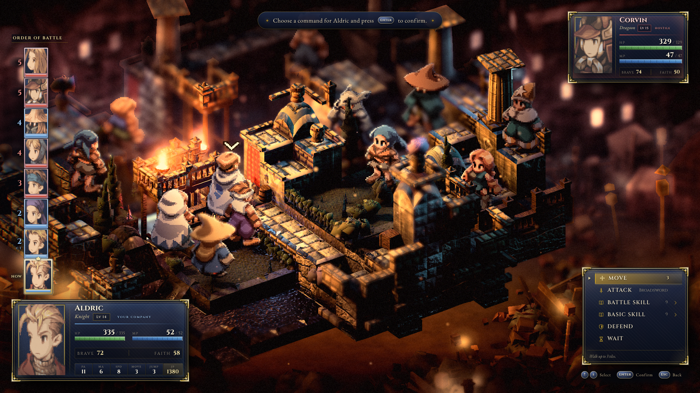

# EverTactics

A tactical RPG in the lineage of **Final Fantasy Tactics** and **Triangle Strategy**, built in
Three.js. HD-2D: pixel-art sprites billboarded inside a fully lit, post-processed 3D diorama.



---

## What's here

**A complete battle engine.** Charge-Time turn order with a predictive forecast, movement with
height and jump rules, facing with back-attack bonuses, FFT damage formulas, zodiac compatibility,
a full status engine, and reaction abilities that actually fire. Everything is deterministic: the
same seed replays byte-identically, which is what makes the AI testable.

**34 jobs.** The complete Final Fantasy Tactics roster (22 jobs, Squire through Onion Knight) plus
six drawn from **EverQuest II** — Shadowknight, Templar, Coercer, Beastlord, Troubador, Dirge — and
six from **World of Warcraft** — Death Knight, Warlock, Druid, Paladin, Rogue, Shaman. The borrowed
jobs carry real mechanical identity rather than reskins: runic resources, soul shards, combo points,
totems placed on tiles, warder pets, stance-shifting, threat and wards.

~395 abilities, a JP economy, and a job tree you can actually open mid-battle.

**An AI that plays properly.** It scores every reachable destination against every legal ability,
weighing expected damage through the real combat formulas, height advantage, facing exposure, AoE
friendly-fire, and charge-time prediction. Seven personality archetypes produce visibly different
behaviour. Verified to resolve 16/16 battles across 8 seeds and 2 maps.

**A renderer built to a measured target.** Procedural PBR-ish terrain with stochastic tiling and
role-based stone materials, a surround of silhouette architecture with practical lights, source-
driven bounce GI, contact-hardening shadows, tilt-shift depth of field, and a colour grade tuned
against measured reference bands rather than taste.

**Authentic sprite animation.** The original FFT `SHP`/`SEQ` part-assembly format is decoded from
the game's own binaries — animation frames are composited from heads, limbs, capes and boots exactly
as the 1997 engine did. See `docs/ASSETS.md`.

---

## Running it

```bash
npm install
npm run dev            # http://localhost:5173

npm run verify         # typecheck + tests + build + render + measure (~2 min)
npm run verify:quick   # typecheck + tests only
npm test               # 429 tests
```

Controls: arrow keys and Enter drive the command menu, `J` opens the job screen, `F` formation,
`R` roster, Escape backs out. Mouse works for tile selection.

---

## How it's built

```
src/core/     pure, deterministic game logic — never imports three.js
src/render/   three.js only — stage, camera, terrain, sprites, lighting, post, VFX
src/ui/       DOM overlay — menus, turn rail, panels, screens
src/state/    the seam: scenarios, view models, and the one game loop
tools/        asset pipeline, screenshot/play harnesses, metrics, workflows
docs/         architecture, measured asset formats, the visual target, project status
```

The core rule: **commands in, events out.** `BattleState` is mutated only by `applyCommand`, which
returns a `BattleEvent[]`. The renderer animates that event stream; the UI issues commands. Nothing
in `src/core/` knows three.js exists, which is why the whole battle engine is unit-testable and
replayable.

---

## Tooling worth stealing

The interesting part of this project may be the verification harness rather than the game.

- **`tools/shoot.mjs`** — headless render of any scenario. Fails the shot if the frame never
  converged, if the boot splash is still up, if the frame is effectively blank, or if **any shader
  failed to compile** — a failed material doesn't blank the frame, three.js falls back and renders
  something plausible but wrong.
- **`tools/metrics.mjs`** — objective frame metrics (connected-component void fraction, luminance
  spread, local contrast, saturation) with thresholds **measured from a reference corpus**, not
  invented.
- **`tools/ab.mjs`** — blind A/B pair builder. Normalises two frames to identical size and encoding
  and writes them as neutral `left.png` / `right.png`; which side is which is never written to disk.
- **`tools/play.mjs`** — drives real keyboard and mouse input into a live build and captures a
  filmstrip. Movement needs a click, not a key — a keys-only harness silently tests nothing.
- **`tools/workflows/`** — multi-agent workflows that fan out fixers and blind-judge the result.

`docs/STATUS.md` carries the full development record, including a list of **seven separate times a
tool reported success while silently doing nothing or the wrong thing.** That list is the most
useful thing in the repository.

---

## Assets

The sprite, portrait and palette data under `public/assets/` and the raw `SHP`/`SEQ` binaries under
`assets-src/` are extracted from **Final Fantasy Tactics: The Ivalice Chronicles** and are the
property of **Square Enix**. They are included here as development placeholders. This project is a
non-commercial technical exercise, is not affiliated with or endorsed by Square Enix, and the game
art is not licensed for redistribution or reuse.

`docs/ASSETS.md` documents the measured file formats in full, so the pipeline can be pointed at your
own dump.

The **code** in this repository is original work — see `LICENSE`.
