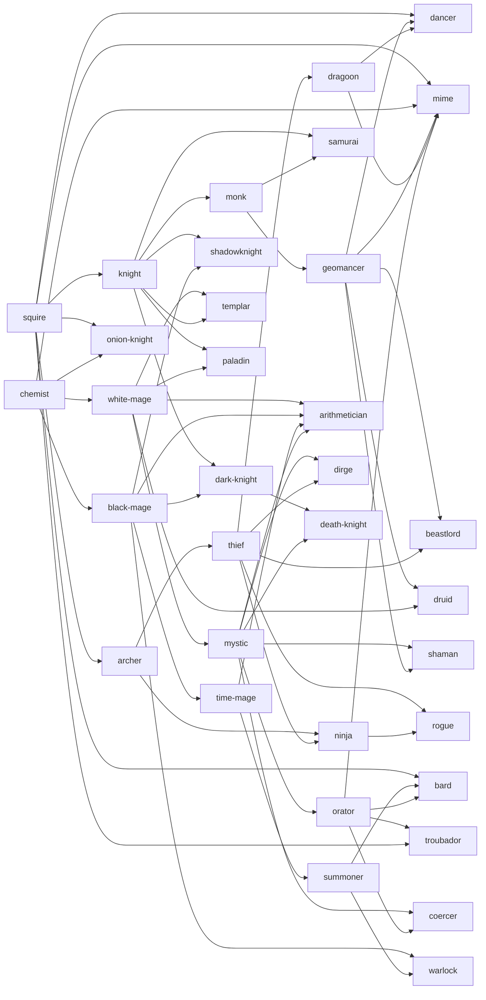

# EverTactics — Jobs

34 jobs: the full canonical Final Fantasy Tactics roster (22), six drawn from EverQuest II,
and six from World of Warcraft. This document is the design record; the data itself lives in
`src/core/jobs/` and is the source of truth.

| File | Contains |
|---|---|
| `src/core/jobs/fft.ts` | The 22 FFT jobs. |
| `src/core/jobs/eq2.ts` | Six EQ2-lineage jobs + their mechanics. |
| `src/core/jobs/wow.ts` | Six WoW-lineage jobs + their mechanics. |
| `src/core/jobs/tree.ts` | Unlock graph, job levels, gender locks, tree layout. |
| `src/core/jobs/index.ts` | `JOBS`, `getJob`, `allJobs`, `JOB_MECHANICS`, validation. |

Verify the tables at any time with:

```
node --experimental-strip-types --import ./tools/ts-ext-hook-register.mjs tools/check-jobs.mts
```

That runs `validateJobs()` + `validateTree()` and confirms every sprite key a job, pet or stance
references resolves to a sheet in `public/assets/sprites/` that is **usable** — present on disk,
not flagged `broken` in `public/assets/manifest.json`, and carrying at least one whole-body pose
frame. Existence alone is not enough: sheets `1110`-`1130` exist but contain no artwork. It
currently reports **34 jobs, 76 sprite refs, OK.**

---

## Conventions other subsystems depend on

**Sprite keys are the sheet's filename stem.** `1000_Knight_Male_hd` resolves to
`public/assets/sprites/1000_Knight_Male_hd.png`. No indirection table, no aliasing — a key is
a filename, so a bad key is a build-time failure rather than a silent grey box. The FFT sheets
come in pairs (`1000`/`1001` are both `Knight_Male`); jobs always reference the **first** of the
pair.

**Ability ids are globally-unique kebab-case slugs** of the ability's canonical name:
`head-break`, `equip-armor`, `move-plus-1`, `fira`, `raise-thrall`. Not namespaced by set —
FFT ability names are already unique, and flat ids keep the learned-ability `Set<AbilityId>`
on `Unit` simple.

**Ability set ids are the kebab-case command name**: `battle-skill`, `white-magick`, `punch-art`,
`draw-out`, `dread-arts`, `runic-strike`. Every `Job.actionSet` is the **canonical** id as
registered in `ABILITY_SETS` — not one of the spellings `SET_ALIASES` tolerates — so a job's
command menu resolves by direct lookup. `resolveSetId()` still accepts the aliases and should
still be used by anything taking a set id from outside `core/abilities`.

### Canonical set names

The job table and the ability table were authored in parallel and named seven sets twice, which
left ten jobs pointing at sets containing zero abilities. One name per set is now canonical on
both sides; the loser of each pair survives in `SET_ALIASES` so nothing holding an old id breaks.

| Canonical | Superseded | Why this one |
|---|---|---|
| `dread-arts` | `threat-arts` | Reads as a command rather than as a mechanic. The set is the Shadowknight's alone, and "Threat Arts" names the threat table instead of what the button does. |
| `sacraments` | `ward-craft` | The Templar is cathedral clergy; "Ancestral Ward Craft" was shaman flavour on a job that has none. |
| `enthrall` | `coercion` | A verb beats an abstract noun in a menu, and it does not simply restate the job name back at the player. |
| `primal-bond` | `beast-command` | Names the relationship the job is actually about. The warder is not a summon taking orders. |
| `subterfuge` | `subtlety` | `subtlety` is already a support **ability** id. Two different things under one name in one table is a bug waiting to be written. |
| `wild-shape` | `stances` | The set belongs to the Druid, and no Berserker job exists to justify the generic name. Its contents were rewritten from generic postures into forms, feral strikes and the unshifted healing kit. |
| `judgement` | `auras` | The command is the seal → strike → collect loop; the auras are its passive floor, not the whole menu. The collector ability is `divine-judgement`, so a set id and an ability id never collide. |

Three further sets are deliberately unowned and exist as secondary commands and enemy-unit kit:
`snatch`, `holy-sword` and `mighty-sword`.

**Job levels are gated by lifetime JP, not unspent JP.** `JobProgress.totalJp` is the gate;
spending JP on abilities never costs tree progress. Thresholds are FFT's:

| Job level | 1 | 2 | 3 | 4 | 5 | 6 | 7 | 8 |
|---|---|---|---|---|---|---|---|---|
| Total JP | 0 | 100 | 200 | 400 | 700 | 1100 | 1600 | 2200 → 8 at 3000 |

**`Job` in `core/types.ts` was not modified.** Everything the EQ2/WoW jobs need beyond it
(resource bars, pets, stances, threat, wards) lives in a parallel `JOB_MECHANICS` table
declared in `src/core/jobs/index.ts`. FFT jobs deliberately have no entry.

---

## Stat conventions

`growth` values are **divisors** — lower is better. HP/MP growth sits in the 6–30 band,
PA/MA/SPD growth in the 35–100 band, exactly as in FFT. `mult` are percent multipliers applied
to the raw stat while the job is worn; 100 is neutral. `cEvade` is class evasion before
equipment.

---

## The roster

Growth is `HP/MP/PA/MA/SPD`; multipliers likewise. (M)/(F) marks a gender lock.

| Job | Mv | Jp | C-Ev | Growth | Mult | Command | Unlocks at | Learns |
|---|---|---|---|---|---|---|---|---|
| Squire | 4 | 3 | 5% | 11/15/60/50/100 | 100/100/100/100/100 | `basic-skill` | — | 9 (2100 JP) |
| Chemist | 3 | 3 | 5% | 12/16/75/50/100 | 90/80/90/80/100 | `item` | — | 17 (5080 JP) |
| Knight | 3 | 3 | 10% | 10/15/40/50/100 | 120/80/120/80/100 | `battle-skill` | squire 2 | 11 (2550 JP) |
| Archer | 3 | 3 | 10% | 11/16/45/50/100 | 100/65/110/80/100 | `charge` | squire 2 | 10 (4070 JP) |
| Monk | 3 | 4 | 20% | 9/16/48/50/100 | 135/80/129/80/100 | `punch-art` | knight 2 | 10 (3700 JP) |
| Thief | 4 | 4 | 25% | 11/17/50/50/90 | 90/60/100/60/110 | `steal` | archer 2 | 9 (2630 JP) |
| White Mage | 3 | 3 | 5% | 12/10/70/45/100 | 80/120/90/110/100 | `white-magick` | chemist 2 | 14 (5530 JP) |
| Black Mage | 3 | 3 | 5% | 12/10/75/45/100 | 75/120/80/120/100 | `black-magick` | chemist 2 | 14 (4700 JP) |
| Time Mage | 3 | 3 | 5% | 12/10/70/50/100 | 75/115/80/110/100 | `time-magick` | black-mage 2 | 16 (8600 JP) |
| Summoner | 3 | 3 | 5% | 13/10/70/40/100 | 70/125/80/120/100 | `summon-magick` | time-mage 3 | 17 (10500 JP) |
| Mystic | 3 | 3 | 10% | 12/12/60/50/100 | 75/110/80/110/100 | `yin-yang-magick` | white-mage 2 | 15 (4480 JP) |
| Geomancer | 4 | 3 | 10% | 11/13/50/50/100 | 110/95/110/105/100 | `geomancy` | monk 3 | 15 (5380 JP) |
| Dragoon | 3 | 4 | 15% | 11/15/40/50/100 | 120/70/120/80/100 | `jump` | thief 3 | 14 (6300 JP) |
| Orator | 3 | 3 | 5% | 12/15/60/50/100 | 80/75/90/90/100 | `talk-skill` | mystic 3 | 13 (3950 JP) |
| Samurai | 3 | 3 | 20% | 12/13/45/50/100 | 100/90/120/110/100 | `draw-out` | knight 4, monk 5 | 13 (7300 JP) |
| Ninja | 4 | 4 | 30% | 12/16/43/50/80 | 80/50/120/75/120 | `throw` | archer 4, thief 5 | 13 (4930 JP) |
| Arithmetician | 3 | 3 | 5% | 14/10/90/50/100 | 60/110/50/80/50 | `math-skill` | white-mage 4, black-mage 4, time-mage 3, mystic 4 | 9 (5200 JP) |
| Bard (M) | 3 | 3 | 5% | 12/15/100/50/100 | 55/110/40/115/100 | `sing` | squire 5, summoner 5, orator 5 | 10 (4900 JP) |
| Dancer (F) | 3 | 3 | 5% | 12/15/50/100/100 | 60/110/110/40/100 | `dance` | squire 5, geomancer 5, dragoon 5 | 10 (4800 JP) |
| Mime | 4 | 4 | 5% | 6/30/35/40/100 | 140/50/120/115/120 | `mimicry` | squire 8, chemist 8, geomancer 4, dragoon 4, orator 4 | 0 |
| Dark Knight | 3 | 3 | 10% | 9/12/40/45/100 | 130/80/130/110/100 | `dark-sword` | knight 8, black-mage 8, **20 kills** | 13 (9100 JP) |
| Onion Knight | 3 | 3 | 5% | 10/15/50/50/100 | 100/100/100/100/100 | `onion-skills` | squire 6, chemist 6 | 8 (2700 JP) |
| Shadowknight | 3 | 3 | 10% | 9/13/45/50/100 | 130/90/118/105/100 | `dread-arts` | knight 4, black-mage 3 | 12 (5650 JP) |
| Templar | 3 | 3 | 10% | 11/11/60/48/100 | 110/115/95/110/100 | `sacraments` | white-mage 4, knight 3 | 12 (5100 JP) |
| Coercer | 3 | 3 | 5% | 13/10/75/45/100 | 70/125/70/120/100 | `enthrall` | mystic 4, orator 3 | 12 (5500 JP) |
| Beastlord | 4 | 4 | 15% | 10/14/48/50/95 | 115/85/115/90/105 | `primal-bond` | geomancer 3, thief 3 | 12 (5080 JP) |
| Troubador | 4 | 3 | 10% | 12/12/70/50/100 | 85/110/80/110/105 | `anthems` | orator 4, squire 5 | 12 (5400 JP) |
| Dirge | 4 | 3 | 15% | 11/12/60/50/95 | 95/105/100/105/105 | `dirges` | mystic 4, thief 3 | 12 (5850 JP) |
| Death Knight | 3 | 3 | 10% | 9/14/42/50/100 | 135/75/125/100/100 | `runic-strike` | dark-knight 3, mystic 3, **30 kills** | 12 (5800 JP) |
| Warlock | 3 | 3 | 5% | 13/10/80/42/100 | 75/125/70/125/100 | `affliction` | black-mage 4, summoner 3 | 12 (5250 JP) |
| Druid | 4 | 3 | 10% | 11/12/55/48/100 | 105/110/100/110/100 | `wild-shape` | geomancer 4, white-mage 3 | 12 (4550 JP) |
| Paladin | 3 | 3 | 10% | 10/13/45/50/100 | 125/95/115/105/100 | `judgement` | knight 4, white-mage 4 | 12 (5300 JP) |
| Rogue | 4 | 4 | 30% | 11/18/46/55/85 | 90/50/122/60/115 | `subterfuge` | thief 4, ninja 2 | 12 (5100 JP) |
| Shaman | 3 | 3 | 5% | 12/11/65/47/100 | 95/115/90/115/100 | `totemcraft` | mystic 3, geomancer 3 | 12 (4800 JP) |

**The Mime learns nothing**, which is authentic rather than an omission: its power is entirely
innate. All three innates are real abilities rather than engine flags — `mimic` (the command
itself), `bare-mimicry` (what it is paid for carrying no equipment at all) and `sole-command`
(the cost: no secondary, no reaction, no support slot).

**The Onion Knight** is the roster's one deliberate departure from FFT. Vanilla gives it nothing
to learn at all, which reads as a bug rather than a joke in a game with a job-detail panel and a
displayed mastery cost. `onion-skills` is the same joke played straight instead: six plain,
cheap, wholly unspecialised soldier's actions with no element and no charge time between them.
The ceiling is still the `onion-mastery` innate — a percent on all five multipliers for every job
taken to level 8 — and never the abilities.

---

## Command menus

Every action set in the game, in menu order, with the job that carries it as a **primary**
command. Anything here can also be taken as a **secondary** command by any job except the two
flagged `primaryOnly` (`math-skill`, `mimicry`), which is why the two unowned FFT sets and the
two story-job sets still earn their place in the table.

Passives are not listed here — they live in one flat pool per slot and any job may take any of
them: 49 support, 31 reaction, 20 movement. `passivesForSlot()` in `src/state/abilityIndex.ts`
is what the job screen's slot pickers read.

| Set | Menu name | Primary job | # | Abilities |
|---|---|---|---|---|
||`basic-skill`|Basic Skill|`squire`|9|Focus, Dash, Throw Stone, Tend, Yell, Steel, Wish, Rally, Shield Bash
||`item`|Item|`chemist`|14|Potion, Hi-Potion, X-Potion, Ether, Hi-Ether, Elixir, Antidote, Eye Drops, Echo Herbs, Maiden's Kiss, Soft, Holy Water, Remedy, Phoenix Down
||`battle-skill`|Battle Skill|`knight`|9|Head Break, Armor Break, Shield Break, Weapon Break, Magick Break, Speed Break, Power Break, Mind Break, Stasis Sword
||`charge`|Charge|`archer`|8|Charge +1 / +2 / +3 / +4 / +5 / +7 / +10 / +20
||`punch-art`|Punch Art|`monk`|8|Spin Fist, Repeating Fist, Wave Fist, Earth Slash, Secret Fist, Purification, Chakra, Revive
||`white-magick`|White Magick|`white-mage`|15|Cure, Cura, Curaga, Curaja, Raise, Arise, Reraise, Regen, Protect, Protectja, Shell, Shellja, Wall, Esuna, Holy
||`black-magick`|Black Magick|`black-mage`|16|Fire · Fira · Firaga · Firaja, Blizzard · Blizzara · Blizzaga · Blizzaja, Thunder · Thundara · Thundaga · Thundaja, Poison, Toad, Death, Flare
||`time-magick`|Time Magick|`time-mage`|14|Haste, Hastega, Slow, Slowga, Stop, Immobilize, Disable, Reflect, Quick, Demi, Demiga, Float, Meteor, Stabilize
||`summon-magick`|Summon Magick|`summoner`|16|Moogle, Shiva, Ramuh, Ifrit, Titan, Golem, Carbuncle, Bahamut, Odin, Leviathan, Salamander, Sylph, Fairy, Lich, Cyclops, Zodiark
||`steal`|Steal|`thief`|8|Steal Gil, Weapon, Shield, Helm, Armor, Accessory, Heart, EXP
||`snatch`|Snatch|— (secondary)|6|Snatch Purse, Weapon, Charm, Breath, Mana, Footing
||`talk-skill`|Talk Skill|`orator`|13|Invitation, Persuade, Praise, Threaten, Preach, Solution, Condemn, Insult, Mimic Daravon, Refute, Beast Tongue, Train, Rehabilitate
||`yin-yang-magick`|Yin-Yang Magick|`mystic`|14|Blind, Spell Absorb, Life Drain, Pray Faith, Doubt Faith, Zombie, Silence Song, Blind Rage, Foxbird, Confusion Song, Dispel, Paralyze, Sleep, Break
||`geomancy`|Geomancy|`geomancer`|14|Pitfall, Water Ball, Hell Ivy, Carve Model, Local Quake, Kamaitachi, Demon Fire, Quicksand, Sandstorm, Blizzard, Gusty Wind, Lava Ball, Static Shock, Will-o'-the-Wisp
||`jump`|Jump|`dragoon`|13|Jump, Level Jump 2/3/4/5/8, Vertical Jump 2/3/4/5/8, High Jump, Dragon Dive
||`draw-out`|Draw Out|`samurai`|10|Asura, Koutetsu, Bizen Boat, Murasame, Heaven's Cloud, Kiyomori, Muramasa, Kikuichimonji, Masamune, Chirijiraden
||`throw`|Throw|`ninja`|14|Shuriken, Fuma Shuriken, Knife, Ninja Blade, Spear, Hammer, Iron Ball, Stick, Wand, Sword, Katana, Axe, Bomb, Caltrops
||`math-skill`|Math Skill|`arithmetician`|8|**Attributes** Charge Time, Level, Experience, Height · **Divisors** Multiple of 3, 4, 5, Prime Number
||`sing`|Sing|`bard`|9|Angel Song, Life Song, Cheer Song, Battle Song, Magick Song, Nameless Song, Space Storage, Last Song, Sky Demon
||`dance`|Dance|`dancer`|9|Witch Hunt, Wiznaibus, Slow Dance, Polka Polka, Disillusion, Nameless Dance, Void Storage, Last Waltz, Obsidian Blade
||`dark-sword`|Dark Sword|`dark-knight`|14|Sanguine Sword, Night Sword, Shadowblade, Crushing Blow, Infernal Strike, Abyssal Blade, Duskblade, Unyielding Blade, Crush Helm/Armor/Weapon/Accessory, Unholy Darkness, Unholy Sacrifice
||`holy-sword`|Holy Sword|`holy-knight` (story)|6|Judgment Blade, Cleansing Strike, Northswain's Strike, Hallowed Bolt, Divine Ruination, Sanctify
||`mighty-sword`|Mighty Sword|`divine-knight` (story)|5|Shellburst Stab, Blastar Punch, Hellcry Punch, Icewolf Bite, Crush Punch
||`mimicry`|Mimicry|`mime`|2|Mimic, Echo Form
||`onion-skills`|Onion Skills|`onion-knight`|6|Onion Slash, Onion Guard, Onion Hurl, Onion Resolve, Onion Mend, Onion Blade
||`dread-arts`|Dread Arts|`shadowknight`|14|Taunt, Sentinel Roar, Rescue, Shield Slam, Provoking Wound, Bulwark, Intercept, Last Stand, Siphon Strike, Harm Touch, Malevolence, Unholy Blessing, Doom Judgement, Sanguine Covenant
||`sacraments`|Sacraments|`templar`|14|Ward of Salvation, Smite of Conviction, Reprieve, Sanctuary, Act of War, Sacrament of Stone, Perseverance, Faithful Bulwark, Divine Arbitration, Torpor, Spirit Tap, Resurrection Rite, Unyielding Benediction, Shield of Faith
||`enthrall`|Enthrall|`coercer`|12|Mesmerize, Mass Mesmerize, Dominate, Spellbind, Mind Blank, Mana Flow, Terrorize, Breeze, Peaceful Link, Cannibalise Thoughts, Possess Essence, Puppetmaster
||`primal-bond`|Primal Bond|`beastlord`|15|Call of the Wild, Savage Mauling, Pack Tactics, Call Back, Mend Companion, Enrage Warder, Beastly Bond, Harrying Strike, Warder Rush, Rending Maul, Bestial Fury, Primal Instinct, Shared Senses, Bond of Blood, Warder's Guard
||`anthems`|Anthems|`troubador`|12|Anthem of Valour, Allegretto, Dodge and Cover, Resonance, Lucky Break, Reverberation, Bria's Entrancing Sonnet, Jester's Cap, Demoralising Processional, Perfect Shrill, Countersong, Maestro's Cadence
||`dirges`|Dirges|`dirge`|12|Percussion of Force, Death Knell, Hymn of Horror, Gravitas, Darksong Blade, Oration of Sacrifice, Cacophony of Blades, Shroud of the Fallen, Clara's Chaotic Cacophony, Luda's Nefarious Wail, Exuberant Encore, Requiem
||`affliction`|Affliction|`warlock`|15|Corruption, Agony, Immolation, Unstable Affliction, Curse of Doom, Drain Life, Shadow Plague, Harvest, Shadow Bolt, Drain Soul, Curse of Tongues, Howl of Terror, Shadowburn, Soulstone, Summon Felguard
||`subterfuge`|Subterfuge|`rogue`|15|Stealth, Vanish, Ambush, Backstab, Sinister Strike, Hemorrhage, Garrote, Cheap Shot, Shadowstep, Eviscerate, Kidney Strike, Rupture, Expose Armour, Slice and Dice, Deadly Crescendo
||`wild-shape`|Wild Shape|`druid`|12|Dire Bear Form, Feral Cat Form, Mangle, Swipe, Shred, Wrath, Moonfire, Entangling Roots, Rejuvenation, Regrowth, Nature's Swiftness, Tranquillity
||`totemcraft`|Totemcraft|`shaman`|15|Searing / Stoneskin / Cleansing / Windfury / Mana Tide / Earthbind / Healing Stream / Tremor Totem, Totemic Recall, Lightning Bolt, Chain Lightning, Earth Shock, Frost Shock, Ancestral Spirit, Bloodlust
||`judgement`|Judgement|`paladin`|15|Devotion / Retribution / Concentration / Sanctity / Crusader Aura, Aura Mastery, Holy Strike, Seal of Righteousness, Seal of Justice, Judgement, Hammer of Justice, Consecration, Blessing of Protection, Lay on Hands, Divine Shield
||`runic-strike`|Runic Strike|`death-knight`|13|Blood Strike, Frost Strike, Unholy Blight, Death Coil, Rune Tap, Howling Blast, Marked for Death, Raise Thrall, Obliterate, Chains of Ice, Anti-Magic Shell, Death and Decay, Army of the Dead

The tables that back this are `SET_LIST` (metadata) and the per-set `actions(...)` blocks in
`src/core/abilities/sets.ts`. To add an ability, add it to its set's block and to the owning
job's `learnable` list — `jobSkillset()` will surface anything the job table misses, but an
ability nobody priced shows up at a generated JP cost rather than a designed one.

---

## The unlock tree

The FFT half is the canonical PSX tree, unchanged. The two imported lanes hang off it so the
roster reads as one continuous tree rather than three rosters side by side.



**Placement reasoning.** Each imported job hangs off the FFT jobs whose fantasy it extends and
whose stats it inherits — Templar off White Mage + Knight because it is a plate-wearing healer;
Rogue behind Ninja because it is the *end* of the stealth line, not a parallel to Thief; Death
Knight behind Dark Knight because Ivalice already has a forbidden-knight discipline and the WoW
version should read as its terminal, undead stage. Death Knight is the deepest job in the game
(Dark Knight 3 requires Knight 8 + Black Mage 8 + 20 kills first, then 30 kills of its own).

`SPECIAL_CONDITIONS` in `tree.ts` carries the non-JP gates (kill counts). `canUnlock` takes an
optional `UnlockContext { kills }`; if the caller does not supply it, kills read as 0 and those
two jobs stay locked. The campaign layer must pass the real number.

Layout for the tree screen is `JOB_TREE_LAYOUT` (grid cells: `lane`, `column`, `row`) plus
`JOB_TREE_LANES` for the three panel headers. `validateTree()` asserts every job is placed
exactly once, no requirement cycles exist, and no job is drawn left of its own prerequisite.

---

## Sprite mapping

FFT jobs map 1:1 onto their own sheets, with two exceptions. Bard and Dancer are gender-locked,
so both slots point at the single existing sheet.

**Dark Knight and Onion Knight borrow.** The WotL-exclusive sheets (`1110`-`1130`) are broken in
this rip — 18-pixel grey noise strips containing no artwork, flagged `broken: true` in
`public/assets/manifest.json` and documented in docs/ASSETS.md §1.2. `SpriteAtlas.loadSheet`
rejects them outright, so a job pointing at one renders nothing at all. Both jobs therefore
borrow a live sheet and are separated by palette, exactly as the twelve imported jobs are; the
recolours are in the borrowed-sheets table below. **Do not point anything at `1110`-`1130`** —
`tools/check-jobs.mts` fails the build if you do.

| Job | Male sheet | Female sheet |
|---|---|---|
| Squire | `924_Squire_Male_hd` | `994_Squire_Female_hd` |
| Chemist | `996_Chemist_Male_hd` | `998_Chemist_Female_hd` |
| Knight | `1000_Knight_Male_hd` | `1002_Knight_Female_hd` |
| Archer | `1004_Archer_Male_hd` | `1006_Archer_Female_hd` |
| Monk | `1008_Monk_Male_hd` | `1010_Monk_Female_hd` |
| White Mage | `1012_White_Mage_Male_hd` | `1014_White_Mage_Female_hd` |
| Black Mage | `1016_Black_Mage_Male_hd` | `1018_Black_Mage_Female_hd` |
| Time Mage | `1020_Time_Mage_Male_hd` | `1022_Time_Mage_Female_hd` |
| Summoner | `1024_Summoner_Male_hd` | `1026_Summoner_Female_hd` |
| Thief | `1028_Thief_Male_hd` | `1030_Thief_Female_hd` |
| Orator | `1032_Orator_Male_hd` | `1034_Orator_Female_hd` |
| Mystic | `1036_Mystic_Male_hd` | `1038_Mystic_Female_hd` |
| Geomancer | `1040_Geomancer_Male_hd` | `1042_Geomancer_Female_hd` |
| Dragoon | `1044_Dragoon_Male_hd` | `1046_Dragoon_Female_hd` |
| Samurai | `1048_Samurai_Male_hd` | `1050_Samurai_Female_hd` |
| Ninja | `1052_Ninja_Male_hd` | `1054_Ninja_Female_hd` |
| Arithmetician | `1056_Arithmetician_Male_hd` | `1058_Arithmetician_Female_hd` |
| Bard (M) | `1060_Bard_Male_hd` | — |
| Dancer (F) | — | `1062_Dancer_Female_hd` |
| Mime | `1064_Mime_Male_hd` | `1066_Mime_Female_hd` |
| Dark Knight | `1000_Knight_Male_hd` (borrowed) | `1002_Knight_Female_hd` (borrowed) |
| Onion Knight | `924_Squire_Male_hd` (borrowed) | `994_Squire_Female_hd` (borrowed) |

### Borrowed sheets

Fourteen jobs have no usable art of their own — the twelve imported ones, which were never in
FFT, plus Dark Knight and Onion Knight, whose sheets are broken rips. Each borrows a
thematically-adjacent FFT sheet;
the recolour/edit each one needs to stop reading as its donor is recorded in
`JOB_MECHANICS.get(id).spriteBorrow` in code, and summarised here. **Palette-only** entries can
ship immediately through the GPU palette-LUT path; **edit** entries need real pixel work.

| Job | Borrows | Work needed | Cost |
|---|---|---|---|
| Dark Knight | `1000`/`1002` Knight | Blackened plate, oxblood trim, matte-dark rather than the Knight's polished steel; drop the shield, lengthen the blade | palette + small edit |
| Onion Knight | `924`/`994` Squire | Off-white and onion-green over the Squire's browns, brass buckles; the joke needs it to read as *deliberately* plain, so no added detail | palette only |
| Shadowknight | `1044`/`1046` Dragoon | Bruised violet plate, bone trim, green sigil; shorten helm horns to a crest so it stops reading as a lancer, spear cells → flail, add a shield | palette + edit |
| Death Knight | `1048`/`1050` Samurai | Steel-blue rime palette, cyan under-helm eyes, frost fume on idle cells; drop the topknot, square the helm, katana cells → greatsword | palette + edit |
| Templar | `1000` Knight / `880` Agrias | White-and-gold liturgy; male sword cells repainted to a flanged mace, stole on pauldrons | palette + edit (M) |
| Paladin | `1000`/`1002` Knight | Brass/crimson tabard, sunburst shield; sword cells → two-handed war hammer | palette + edit |
| Coercer | `1036`/`1038` Mystic | Indigo-and-brass; floating focus-gem on idle, pole cells → open palm | palette + small edit |
| Shaman | `1036`/`1038` Mystic | Earth-tone leathers, turquoise beading, antlered half-mask | palette + edit |
| Beastlord | `1040`/`1042` Geomancer | Ochre hide, fur mantle, claw-wraps replacing sword cells | palette + edit |
| Druid | `1040`/`1042` Geomancer | Moss/bark palette, antler motif in hood cells | palette + small edit |
| Troubador | `1032`/`1034` Orator | Sapphire-and-gold motley; scroll/gun cells → lute, arm poses lifted from `1060` | palette + edit |
| Dirge | `1060` Bard / `1062` Dancer | Funereal black/bone; hood the Bard's head cells, harp → slung drum; Dancer silks → mourning weeds | palette + edit |
| Warlock | `1016`/`1018` Black Mage | Fel-green over charcoal, green face-light; straw hat → horned hood (the hat is too iconic to keep) | palette + edit |
| Rogue | `1028`/`1030` Thief | Black/oxblood, raised cowl, second off-hand dagger; stealth renders the same sheet at ~35% opacity | palette + small edit |

Non-unit sheets used by mechanics:

| Entity | Sheet | Note |
|---|---|---|
| Beastlord's Warder | `1074_Coeurl_hd` | Warmer palette + a collar detail so it reads bonded, not wild |
| Death Knight's Ghoul | `1078_Skeleton_hd` | Used as-is |
| Warlock's Felguard | `1106_Demon_hd` | Green rim light to read as bound |
| Druid bear form | `1090_Minotaur_hd` | Largest edit in the roster: shorten horns to stubs, broaden muzzle, brown-black palette |
| Druid cat form | `1137_Coeurl_2_hd` | Tawny recolour, tendrils removed from head cells |
| Shaman totems | `1088_Treant_hd` | Crop one upright segment, half unit height, four painted variants (stone / brazier / water / feathered pole), two-frame glow |

Sheet sharing is deliberate — the palette-LUT pipeline exists precisely so one sheet can carry
several classes — but it has a limit, and the Knight sheet is at it: Knight, Paladin, Templar
(male) and Dark Knight all sit on `1000`/`1002`. That is why Shadowknight and Death Knight were
moved onto the Dragoon and Samurai sheets rather than piling onto the Knight as well when their
Dark Knight donor turned out to be broken: four plate jobs on one silhouette is already one too
many. Paladin and Templar both need their silhouette-changing weapon edit before shipping, or
the player will not be able to tell four knights apart at a glance on a busy field.

Nothing in the roster references `1068` Chocobo, which is correct — it has zero whole-body pose
frames and needs SHP part assembly before anything can render it.

---

## What makes each borrowed job distinct

None of the twelve is a recoloured FFT job. Each brings a mechanic the FFT roster has no
vocabulary for, declared in `JOB_MECHANICS` so `core/abilities`, `core/combat` and `core/ai`
can implement it without guessing.

### EverQuest II

**Shadowknight** — the only job that *wants* to be hit. Real threat table: `generated: 2.0`
doubles all threat he produces, and `taunt` is a hard taunt applying the `taunted`
status that forces enemy AI target selection. Builds **Dread** from damage taken (1 per 4 HP,
+5 per enemy that targeted him) and spends it on lifetaps returning 50% of damage dealt as HP.
FFT has no threat concept at all — this is the job that introduces one, and the enemy AI needs
to honour it for tanking to exist in this game.

**Templar** — wards, not heals. A ward is an absorb pool (`MA * 2.4`) that eats damage *before*
HP; the resolver must drain `shielded` first and emit `status-remove` when it empties. Wards do
not stack — recast replaces, taking the larger. `sanctuary` is reactive: it fires a heal the
instant the warded ally is struck, resolving before CT moves, which saves units a White Mage
could not have reached in time. Healing generates 0.8 threat per point, so over-healing pulls.

**Coercer** — takes enemies off the board by *using* them. `charm` re-teams the target (it does
not copy or spawn) for as long as **Domination** holds; each charmed unit drains
`10 + floor(level/4)` per turn, and at 0 every charm breaks at once. Break also on the Coercer
being KO'd, on friendly-fire damage, or on expiry; broken targets get 200 ticks of immunity to
the same caster so they cannot be perma-locked. Success is
`50 + (MA - target.MA)*2 - (target.level - level)*3`, floored at 5%. Scenarios flag bosses
charm-immune, not this table.

**Beastlord** — a pet that is genuinely half the job. The warder is on the field from tick one,
cannot be summoned or resummoned, takes its own CT turn, and derives its stats from the master
at deploy (`hp 0.7, pa 0.85, spd 1.1, move 1.25`). Master and warder hitting the same target
build **Savagery** *on the target*, spent whole by `bestial-fury`. If the warder dies the master
loses `warder-bond` (-20% PA) and every Savagery spender for the rest of the battle. Harsh on
purpose: a resummonable pet is not an identity.

**Troubador** — auras that *stack with* Bard songs instead of replacing them. An anthem is a
persistent radius-2 effect anchored to the unit and recomputed on every move; allies gain it on
entering and lose it on leaving, so formation is a live decision. Only one anthem at a time.
The stacking rule is the point: anthems write to the `empowered` channel, Bard songs to their
own, and the combat layer sums rather than maxing — a Bard + Troubador pair is additive, and
that is the strongest support combination in the roster. `countersong` suppresses all enemy
songs, dances and anthems in radius, which is the counter-play.

**Dirge** — sells damage it does not deal. `vulnerable` is a multiplicative +25% damage-taken
modifier applied after defence and before elemental modifiers, so it multiplies *everyone's*
output; `mark` is the single-target +40% on the next hit from any source. `oration-of-sacrifice`
converts any enemy death anywhere on the field into MP for allies within radius 3. Design rule:
if the Dirge ever out-damages the units it is buffing, the tuning has failed.

### World of Warcraft

**Death Knight** — a rune economy instead of MP. Blood, Frost and Unholy each hold 2 charges and
recharge 1 per turn; abilities cost runes *by type*, so the turn-to-turn play is a genuine
resource puzzle rather than a spell list. Spending runes generates **Runic Power**, which bleeds
5 per idle turn so it must be used in the fight it was built in. `raise-thrall` targets a corpse
tile — a KO'd unit that has not yet crystallised — and consumes it, which also denies the enemy
their own raise. The UI needs three pip bars, not an MP bar.

**Warlock** — three damage-over-time channels that coexist on one target (`corruption`/shadow,
`immolation`/fire, `agony`/dark), each ticking independently at the target's turn start.
`agony` ramps 60% → 100% → 140% across its three ticks, so letting it run is rewarded.
`unstable-affliction` damages anyone who dispels it. Kills on afflicted targets yield **Soul
Shards**, which pay for the Felguard, Shadowburn, and `soulstone` — a pre-placed
self-resurrection that stands an ally back up once at 25% HP before the crystal timer starts.
That last one changes how a whole party plays around death.

**Druid** — actual stance shifting, not a buff. Shifting is free, once per turn, and does not
consume move or act. On shift the renderer swaps the **sprite sheet outright**, the command list
is replaced by the stance's `actionSet`, and form-locked statuses drop. Dire Bear is +45% HP /
+15% PA with a taunt and no casting; Feral Cat is Move 5 / Jump 5 / 25% evade building combo
points; unshifted is the healer. Stance multipliers are percentage-point deltas on top of the
job multipliers (bear HP = `105 + 45 = 150%`). Equipment stays equipped and keeps its stat mods,
but weapon damage is replaced by the form's natural attack — otherwise bear form scales off a
staff. The healing kit is unshifted-only, so the Druid must commit to a role per battle.

**Paladin** — persistent radius-3 auras (exactly one active, recomputed on move, stacking with
anthems and songs because all three use different channels) plus a debt mechanic: seals placed
on enemies accrue **Judgement Debt** on the target, capped at 3, consumed whole by `divine-judgement`.
The loop is seal → attack twice → judge. `lay-on-hands` is a once-per-battle full heal that
zeroes the Paladin's MP and must be surfaced in the UI as an obviously-single-use resource.
`divine-shield` grants a round of immunity and wipes all threat he holds — the escape valve.

**Rogue** — stealth as a board state the targeting layer must respect. While `stealth` holds the
unit is excluded from enemy ability target lists *and* AI target selection entirely, and is
revealed the moment it acts with anything but a move or an opener. Adjacent enemies roll
detection at their turn start at `30 + (level - rogue.level) * 5` percent, so hugging the enemy
line is not free. **Combo points live on the target, not the Rogue** — switching targets abandons
the build, which is the whole tension of the job. Finishers scale
`base * (0.6 + 0.35 * points)`, making a five-point Eviscerate 2.35× a one-point one.

**Shaman** — totems are real board entities, not statuses. A totem occupies a tile (blocking
movement through it), has HP equal to 25% of the Shaman's, cannot move or be healed, has Speed 0
so it never takes a CT turn, and pulses over radius 2 at the start of each of the Shaman's turns.
Enemies can and should destroy them. Placement range 3, vertical tolerance 2. Four slots, one per
element; placing a second of an element destroys the first. Because totems do not follow, the
Shaman is the only genuinely positional support job — the correct play is reading where the line
will be in two turns and planting there. `tremor-totem` pulses a cleanse of `charm`, `confuse`
and `sleep`, making it the direct counter to an enemy Coercer.

---

## What the ability layer must implement for these to work

`JOB_MECHANICS.get(id).keyAbilities` lists the minimum per job. Beyond the ability table itself,
the following need engine support that does not exist in vanilla FFT:

1. **Threat table** — per-unit accumulated threat, consumed by `core/ai` target selection, with
   the `taunted` status as a hard override. Needed by Shadowknight, Death Knight, Paladin, Druid
   (bear), Templar.
2. **Absorb pools** — `shielded` carries a numeric pool drained before HP. Needed by Templar,
   and by Shaman's `stoneskin-totem`.
3. **Target-held resources** — combo points, Savagery and Judgement Debt live on the *target*,
   not the actor, and are cleared when it dies. One shared mechanism serves Rogue, Druid,
   Beastlord and Paladin.
4. **Persistent field entities** — pets (warder, ghoul, felguard) take CT turns; totems do not.
   Both occupy tiles and can be destroyed.
5. **Stance swap** — replace sprite sheet, command set and stat deltas on a free action.
6. **Independent DoT channels** — three simultaneous, separately-ticking, separately-dispellable
   effects on one unit.
7. **Charm re-teaming** — change `unit.team` and hand control over, reversibly, with immunity
   bookkeeping.

Numbers quoted throughout are the intended first-pass tuning and are all reachable from the data
tables — none of them are hard-coded anywhere in `core/jobs/`.
